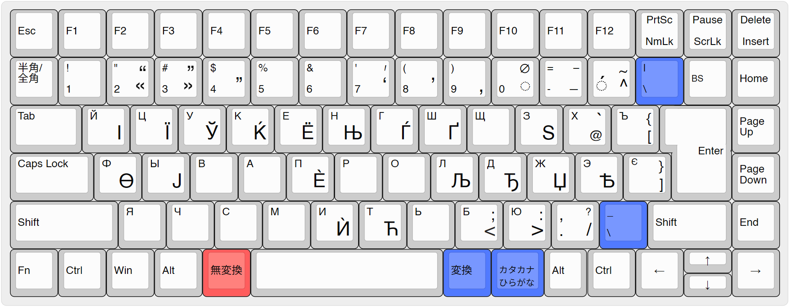
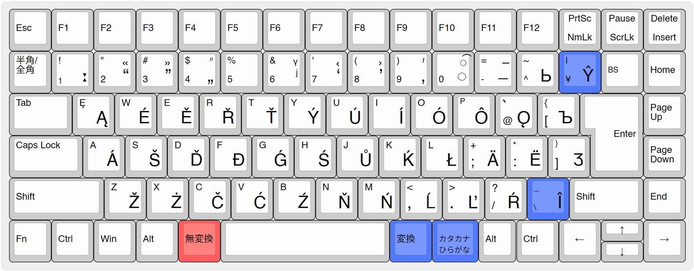
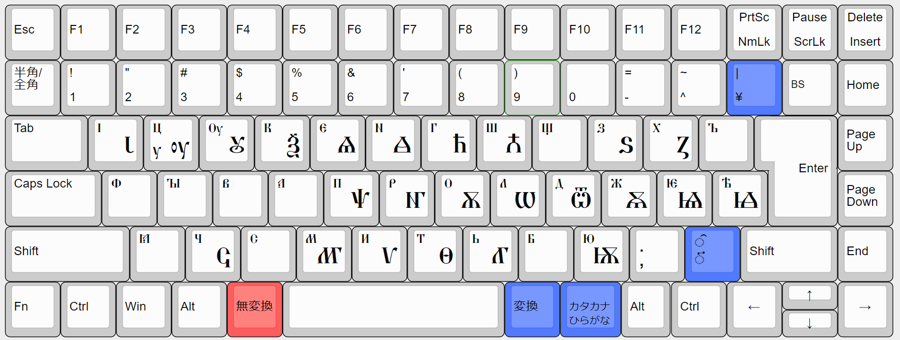
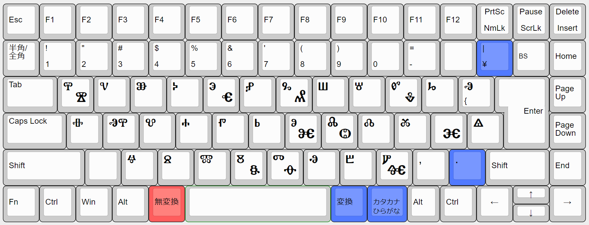

# UniSlav
<!--markdown-to-html --config .github\config.json --output README.html --img-base64-->

See also [Wiki](https://github.com/Mijadaj/UniSlav/wiki).

## Features

- Allows typing most of the characters used in Slavic languages, including Cyrillic, Latin, and Glagolitic scripts.
- Supports diacritics used in Slavic linguistics: e.g., `ȑ ȓ ẹ ǫ`.
- Always outputs precomposed characters if defined by Unicode NFC (Normalization Form C).
- If no precomposed character exists, it outputs combining diacritical marks, unlike the dead keys on the US-International keyboard, which in that case output `~w` instead of `w̃` (`U+0077` `U+0303`).
- Created with [AutoHotkey](https://www.autohotkey.com/), making it easily customizable.

## System Requirements

- Windows 7 and later, 64-bit

## Installation

1. Download the installer (`UniSlav_(version)_Installer.exe`) from the [latest release](https://github.com/Mijadaj/UniSlav/releases/latest).
1. Run the installer and follow the on-screen instructions.
1. After installation, open UniSlav Manager and click “Launch”.

or

1. Download the zip file from the latest release and decompress it. Replace the `UniSlav` folder wherever you want.
1. Double-click the shortcut file `UniSlav Manager` under `UniSlav\`.

Please note that security software may issue a warning. In such cases, you can decide whether to proceed with the installation at your discretion. You can verify the safety of the program from [VirusTotal](https://www.virustotal.com/gui/home/upload).

## Usage

1. Open **UniSlav Manager** and click “Launch”.  
1. Each keyboard can be activated or deactivated using the following hotkeys, which can be customized in the ‘UniSlav Manager’.
    - **`Ctrl + 1`** for Modern Slavic languages
        - **Slavic Cyrillic** (Press once)  
            Russian, Ukrainian, Rusyn, Belarusian, Bulgarian, Macedonian, Serbian *etc.*
        - **Slavic Latin** (Press twice)  
            Polish, Czech, Slovak, Croatian, Slovene, Bosnian, Montenegrin, Kashubian, Sorbian, Prekmurje Slovene, Banat Bulgarian, Proto-Slavic *etc.*; as well as several diacritics and ligatures from French, Romanian, Welsh, German, Icelandic, Lithuanian, Latvian, Hungarian, Esperanto.
    - **`Ctrl + 2`** for Church Slavonic
        - **Early Cyrillic, Glagolitic**

**Note:**
The developer usually uses a 106/109 Japanese keyboard and has developed this AHK script accordingly, so it may not be directly applicable to keyboards for other languages.
If so, please [fork this repository](https://github.com/Mijadaj/UniSlav/fork) and adjust the hotkeys as needed.

### Position of Each Key Based on JIS Layout

The colored (red and blue) keys are not in the ANSI/ISO layouts. Red indicates a modifier key for entering the characters shown at the bottom right corner of each key, which can be customized to Alt, AltGr, or the menu key in the UniSlav Manager.

  
  
  

### List of Dead Keys Used on Slavic Latin Keyboard

e.g. `Ctrl + -`, `A` = **ā**; `Ctrl + Shift + [`, `Shift + O` = **Ő**; `Ctrl + -`, `Ctrl + ;`, `O` = **ǭ**, `Ctrl + ]`, `Shift + a` = **Æ**

| Diacritics |  | Dead keys (`Ctrl +`) | Examples using `A` key | Remarks |
|---|---|---|---|---|
| Breve | ◌̆ (U+0306) | `0` | Ă ă |  |
| Inverted Breve | ◌̑ (U+0311) | `Shift + 0` | Ȃ ȃ |  |
| Macron | ◌̄ (U+0304) | `-` | Ā ā |  |
| Tilde | ◌̃ (U+0303) | `Shift + -` | Ã ã |  |
| Circumflex | ◌̂ (U+0302) | `^` | Â â | ANSI/ISO keyboards: `=` |
| Háček/Caron | ◌̌ (U+030C) | `Shift + ^` | Ǎ ǎ | ANSI/ISO: `Shift + =` |
| Grave | ◌̀ (U+0300) | `@` | À à | ANSI/ISO: `[` |
| Double grave | ◌̏ (U+030F) | `Shift + @` | Ȁ ȁ | ANSI/ISO: `Shift + [` |
| Acute | ◌́ (U+0301) | `[` | Á á | ANSI/ISO: `]` |
| Double acute | ◌̋ (U+030B) | `Shift + [` | A̋ a̋ | ANSI/ISO: `Shift + ]` |
| Ogonek | ◌̨ (U+0328) | `;` | Ą ą |  |
| Inverted dot below | ◌̯ (U+032F) | `Shift + ;` | A̯ a̯ |  |
| Trema | ◌̈ (U+0308) | `:` | Ä ä | ANSI/ISO: `'` |
| misc. |  | `]` | Æ æ | ANSI/ISO: `\`. ß `S`, ə `E`, ı `I`, œ `O`, ø `U`, ð `D`, þ `T` |
| Cedilla/Comma | ◌̧ (U+0327) | `,` | A̧ a̧ | Outputs Romanian ș `S`, ț `T` (comma below) instead of ş, ţ (cedilla). |
| Dot below | ◌̣ (U+0323) | `.` | Ạ ạ |  |
| Dot above | ◌̇ (U+0307) | `Shift + .` | Ȧ ȧ |  |
| Ring below | ◌̥ (U+0325) | `/` | Ḁ ḁ |  |
| Ring above | ◌̊ (U+030A) | `Shift + /` | Å å |  |

日本語話者向けの解説：[スラヴ語汎用キーボードUniSlav](https://note.com/dajdarabotci/n/n1996aa766adc?sub_rt=share_sb)

## License

This software is licensed under the GNU General Public License, version 2 (GPLv2).
You can redistribute it and/or modify it under the terms of the GPLv2.

Please see the [LICENSE file](LICENSE) for more details.

    
Executable files

This software includes:

- **AutoHotkey64.exe**, which is also licensed under the GPLv2.
You can find the source code for AutoHotkey at:
<https://github.com/AutoHotkey/AutoHotkey>.
- **config.exe**, which is compiled from AHK file using [AHK2EXE](https://github.com/AutoHotkey/Ahk2Exe).
The source code can be found in [config.ahk](src/config/config.ahk).

